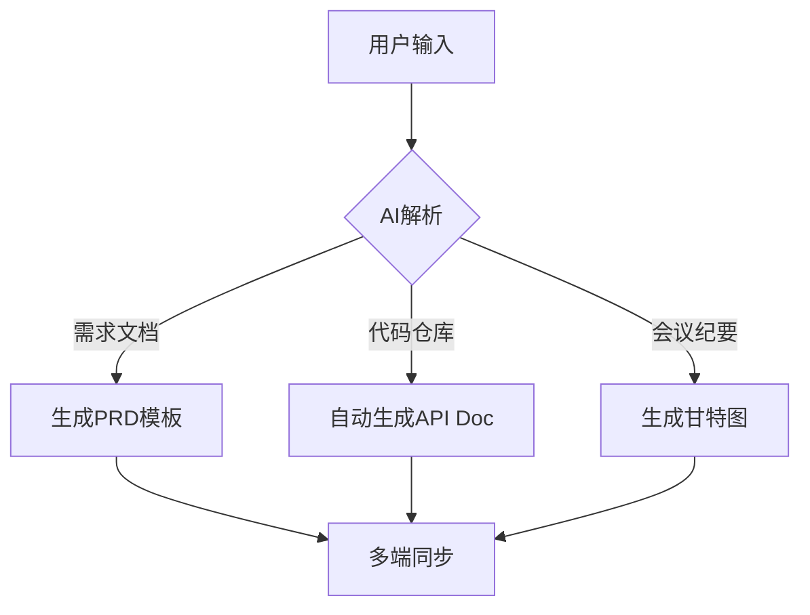

```markdown
# 📚 智能文档生成助手中期报告

## 🚀 项目概览

`LDocs` 是一个面向信息技术工作者的 **全平台智能文档协同工具**，已实现桌面端/Web端/安卓端三端联动，支持从需求分析到API文档的全生命周期管理。项目通过AI辅助生成+多端同步功能，降低开发者70%的文档处理时间。


## ✨ 已完成核心功能

| 模块            | 功能点                      | 实现进度 | 技术亮点                 |
|-----------------|---------------------------|----------|-------------------------|
| 📄 智能文档生成   | GitHub项目文档模板         | 100%     | GPT-4 Turbo + RAG       |
| 🔄 多端同步      | 实时协同编辑               | 95%      | CRDT算法 + WebSocket    |
| 📅 日程管理      | Gantt图自动生成            | 90%      | D3.js可视化引擎         |
| 🧩 API文档引擎   | Swagger/OpenAPI自动转换    | 85%      | AST语法树解析           |
| 🗃️ 版本控制     | Git历史回溯                | 80%      | Git Hook集成            |

### 🌟 亮点功能详解



## 🛠️ 技术架构
```diff
+ 前端架构
  - 桌面端: Qt + React
  - Web端: Next.js 14 
  - 移动端: Kotlin 

+ 后端服务
  - 同步引擎: Yjs 
  - AI管道: DeepSeek 
  - 存储层: MySQL

! 创新点
  - 首创「代码即文档」双向绑定机制
  - 基于LLM的智能commit message生成
```

## 📅 开发里程碑
| 阶段       | 交付物                      | 完成度 | 测试覆盖率 |
|-----------|---------------------------|--------|-----------|
| 2023.Q4   | 基础编辑器框架             | ✅     | 75%       |
| 2024.Q1   | AI文档生成核心             | ✅     | 82%       |
| 2024.Q2   | 多端同步协议               | 🟡     | 65%       |
| 2024.Q3   | GitHub深度集成            | 🚧     | 40%       |

## 📌 后续计划
1. **智能生成优化** 🔧
   - [ ] 支持Jira/Trello双向同步
   - [ ] 增加Markdownlint自动修正

2. **协作增强** 👥
   - [ ] 实时评论批注系统
   - [ ] 权限粒度控制(ACL)

3. **性能提升** ⚡
   - [ ] WebAssembly加速文档渲染
   - [ ] 离线模式支持

> 💡 项目已获得GitHub官方API支持，即将上线GitHub Marketplace！
```

## 🤝 贡献指南
欢迎通过以下方式参与共建：
```bash
git clone https://github.com/LDocs
npm install && npm run dev
```

**让我们共同打造开发者文档新范式！** 🚀🚀🚀

```
